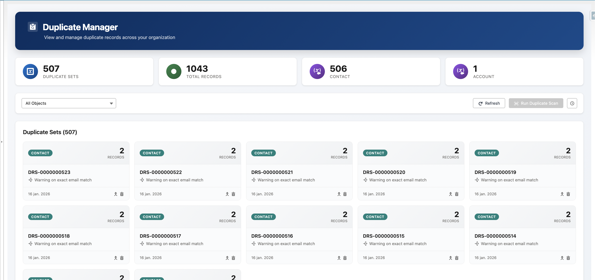
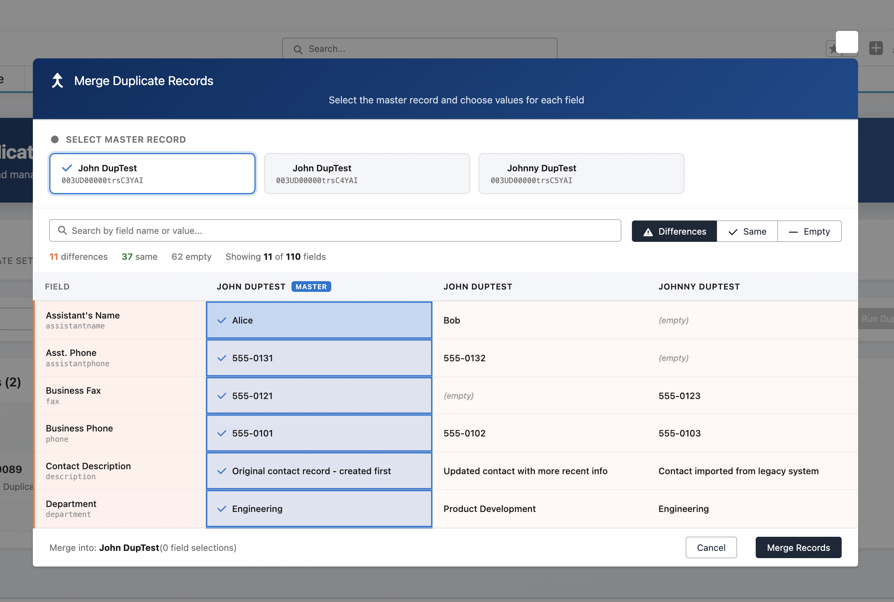

# Duplicate Manager

[](https://developer.salesforce.com)
[](https://opensource.org/licenses/MIT)

A modern, open-source Salesforce unlocked package for viewing, managing, and merging duplicate records. Built with Lightning Web Components and leveraging Salesforce's native duplicate detection API.





## Features

- **Modern Dashboard** - Clean, responsive UI for viewing duplicate record sets across your organization
- **Field-by-Field Merge** - Side-by-side record comparison with the ability to cherry-pick values from any duplicate
- **Automated Scanning** - Queueable job that scans records using Salesforce's native `Datacloud.FindDuplicates` API
- **Scheduling** - Built-in scheduler for daily, weekly, or monthly automated duplicate scans
- **Multi-Object Support** - Works with Contact, Account, Lead, Case, and any object with configured duplicate rules
- **Real-time Progress** - Live job status updates with progress tracking during scans
- **Summary Statistics** - At-a-glance metrics showing duplicate counts by object type

## Installation

### Option 1: Install from Package (Recommended)

```bash
# Install the latest version
sf package install --package DuplicateManager@1.0.0-1 --target-org your-org-alias --wait 10

# Assign permission set
sf org assign permset --name Duplicate_Manager --target-org your-org-alias
```

### Option 2: Deploy from Source

```bash
# Clone the repository
git clone https://github.com/andriisolokh/DuplicateManager.git
cd DuplicateManager

# Deploy to your org
sf project deploy start --target-org your-org-alias

# Assign permission set
sf org assign permset --name Duplicate_Manager --target-org your-org-alias
```

## Quick Start

1. **Install the package** using one of the methods above
2. **Assign the permission set** `Duplicate_Manager` to users who need access
3. **Navigate to the Duplicate Manager tab** in your Salesforce org
4. **Configure duplicate rules** if you haven't already (Setup → Duplicate Rules)
5. **Run a scan** by selecting an object type and clicking "Run Duplicate Scan"

## Documentation

- [Getting Started Guide](docs/GETTING_STARTED.md) - Installation and initial setup
- [Usage Guide](docs/USAGE.md) - How to use the duplicate manager UI
- [Development Guide](docs/DEVELOPMENT.md) - Local development setup
- [Testing Guide](docs/TESTING.md) - Running tests and test data setup

## Components

### Apex Classes
- `DuplicateViewerController` - LWC controller for viewing and managing duplicate sets
- `DuplicateMergeController` - Controller for record comparison and merging
- `DuplicateScannerJob` - Queueable job for batch duplicate scanning
- `DuplicateScannerScheduler` - Schedulable wrapper for periodic scans

### LWC Components
- `duplicateViewer` - Main dashboard component
- `duplicateMergeModal` - Side-by-side merge modal

### Metadata
- `Duplicate_Manager` tab
- `Duplicate_Manager` permission set
- Sample matching rule (Contact email)
- Sample duplicate rule (Contact email)

## Requirements

- Salesforce API version 59.0 or higher
- Duplicate Management feature enabled in your org
- Active Duplicate Rules configured for objects you want to scan

## Contributing

Contributions are welcome! Please read our [Contributing Guide](CONTRIBUTING.md) for details on our code of conduct and the process for submitting pull requests.

## License

This project is licensed under the MIT License - see the [LICENSE](LICENSE) file for details.

## Acknowledgments

- Built with [Salesforce Lightning Web Components](https://developer.salesforce.com/docs/component-library/overview/components)
- Uses [Salesforce Duplicate Management API](https://developer.salesforce.com/docs/atlas.en-us.apexref.meta/apexref/apex_class_Datacloud_FindDuplicates.htm)
